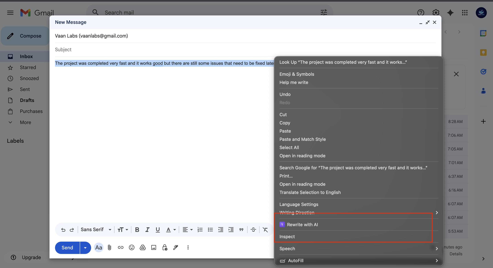
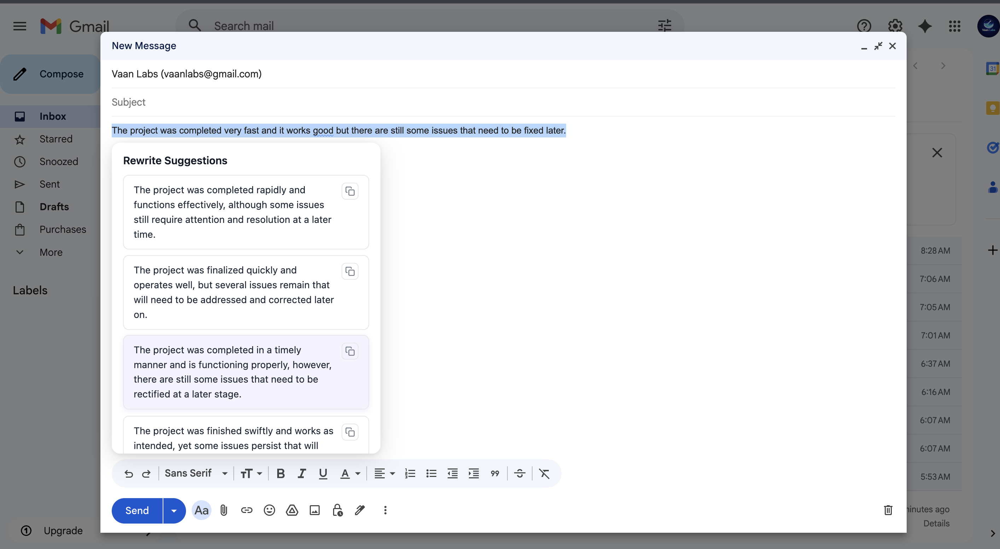
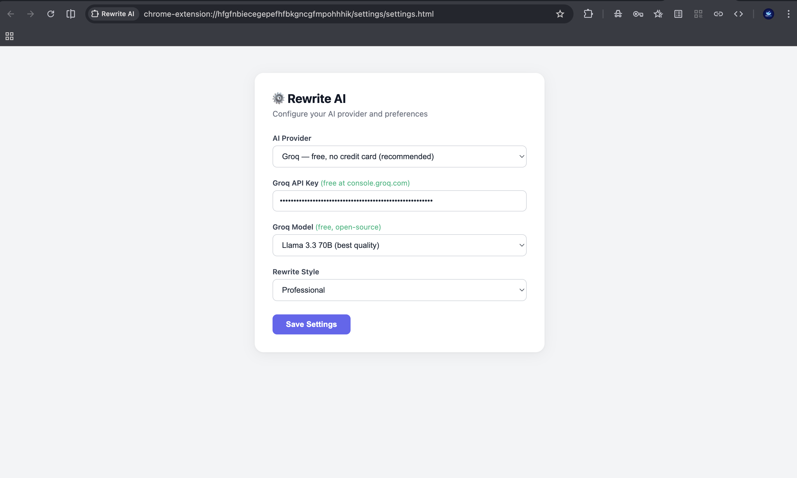

# ✨ Rewrite AI

**Rewrite AI** is a browser extension that helps you instantly rewrite selected text using AI.
Improve clarity, grammar, and tone directly on any webpage.

Built by **Vaan Labs**.

---

## 🚀 Features

* ✏️ Rewrite selected text instantly
* 🤖 Supports multiple AI providers
* 🌐 Works on any webpage
* ⚡ Lightweight and fast
* 🧩 Compatible with **Chromium-based browsers and Firefox**

---

## 🌐 Supported Browsers

Rewrite AI works with:

* Chromium-based browsers (Chrome, Edge, Brave, etc.)
* Firefox

---

## 🧠 Supported AI Providers

The extension supports multiple AI providers:

* OpenAI
* Groq
* Gemini

Users can configure their preferred provider in the extension settings.

---

## 📦 Project Structure

```
rewrite-ai-extension
├── extension/           # Chromium-based browsers
└── extension-firefox/   # Firefox version
```

---

## 🛠 Installation

### Chromium-based Browsers

1. Open your browser and go to:

```
chrome://extensions/
```

2. Enable **Developer Mode**

3. Click **Load Unpacked**

4. Select the folder:

```
extension/
```

---

### Firefox

1. Open Firefox and go to:

```
about:debugging
```

2. Click **This Firefox**

3. Click **Load Temporary Add-on**

4. Select:

```
extension-firefox/manifest.json
```

---

## ⚙️ Setup

After installing the extension:

1. Open the extension settings
2. Choose your AI provider
3. Enter your API key
4. Start rewriting text instantly

---

## 💡 How It Works

1. Select text on any webpage
2. Open the Rewrite AI extension
3. Choose a rewrite option
4. The extension sends the text to the selected AI provider
5. The rewritten version appears instantly

---

## 🔧 Tech Stack

* JavaScript
* Browser Extension APIs
* AI APIs (OpenAI / Groq / Gemini)

---

## 📷 Screenshots

### Context Menu
Right-click on selected text and choose **Rewrite AI** from the context menu.



### Rewrite Suggestions
Rewrite AI generates improved versions of the selected text using AI.



### Settings Page
Configure your preferred AI provider and API keys.



## 🌌 About Vaan Labs

**Vaan Labs** builds useful software tools including:

* AI utilities
* Browser extensions
* Developer productivity tools
* Micro SaaS products

---

## 📫 Contact

GitHub: https://github.com/vaanlabs
Email: [vaanlabs@gmail.com](mailto:vaanlabs@gmail.com)

---

⭐ If you find this project useful, consider giving it a **star**.
